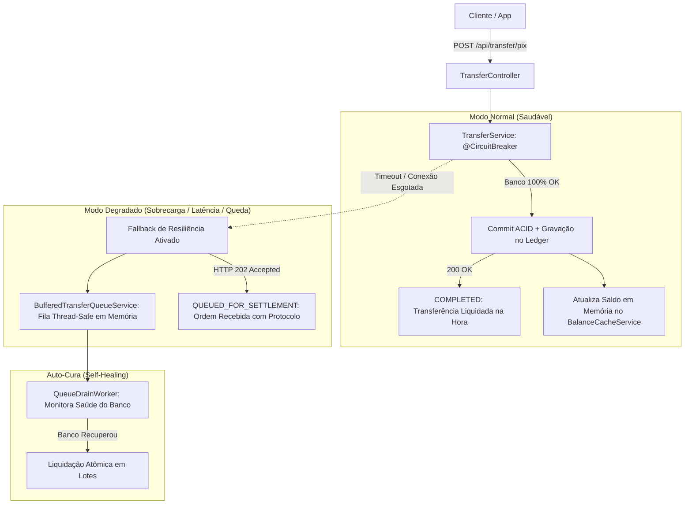

# Digital Wallet Engine — Core Transacional & Degradação Graciosa

> Um motor de carteira digital em Java 17 e Spring Boot 3 projetado para resolver o problema clássico de backend bancário: consistência contábil sob concorrência pesada e sobrevivência quando o banco de dados começa a engasgar.

[](https://openjdk.org/)
[](https://spring.io/projects/spring-boot)
[](src/main/resources/db/migration)
[-success.svg)]()
[](LICENSE)
[](docker-compose.yml)

---

## Por que este projeto existe?

Se você já trabalhou com backend em fintech ou banco digital, já viveu ou ouviu a história clássica da **sexta-feira às 18h** ou do primeiro dia de Black Friday:
1. O tráfego de transferências explode em poucos segundos.
2. Centenas de threads disputam os mesmos registros no banco relacional.
3. O pool de conexões (**HikariCP**) bate no teto de 100% de uso.
4. As requisições começam a estourar timeout de 30 segundos, travam em cascata e o usuário final começa a receber telas vermelhas com **HTTP 500 / 503**.

A maioria dos tutoriais de internet resolve transferência bancária com um simples `UPDATE accounts SET balance = balance - 100`. Em produção, isso abre margem para gasto duplo, concorrência suja e, pior, paralisa a aplicação inteira quando o banco oscila.

O **Digital Wallet Engine** foi construído para atacar esses dois pontos sem rodeios:
- **No fluxo normal:** integridade contábil estrita com partidas dobradas (double-entry), locks pessimistas ordenados contra deadlocks e idempotência distribuída.
- **Sob fogo cruzado (banco saturado ou instável):** ativação imediata de **degradação graciosa**, retendo transferências em fila assíncrona com retorno `HTTP 202 Accepted` e entregando leituras instantâneas de saldo via cache sincronizado.

---

## Como o pipeline funciona

Em condições normais, cada transferência passa por uma esteira determinística:

```
                            Fluxo Transacional da Carteira
┌──────────────────┐
│  Cliente / App   │
└────────┬─────────┘
         │ POST /api/transfer/pix (com Header Idempotency-Key)
         ▼
┌──────────────────┐      Chave já existe?
│ 1. Idempotência  ├──────────────────────────▶ Retorna a resposta original em cache
└────────┬─────────┘
         │ Não (nova transação)
         ▼
┌──────────────────┐      Regra violada?
│ 2. Esteira Risco ├──────────────────────────▶ Aborta com HTTP 422 (sem tocar saldo)
└────────┬─────────┘
         │ Aprovado
         ▼
┌──────────────────┐
│ 3. Lock Ordenado │  Adquire SELECT ... FOR UPDATE sempre na ordem: min(idA, idB) -> max(idA, idB)
└────────┬─────────┘  (Elimina 100% dos deadlocks entre contas simultâneas)
         │
         ▼
┌──────────────────┐
│ 4. Débito/Crédito│  Subtrai de A, credita em B
│    & Ledger      │  Grava lançamentos contábeis imutáveis no Livro-Razão
└────────┬─────────┘
         │
         ▼
┌──────────────────┐
│ 5. Outbox Event  │  Persiste OutboxEvent ("PAYMENT_SETTLED") na MESMA transação do banco
└────────┬─────────┘  (Resolve o clássico problema de dual-write)
         │
         ▼
┌──────────────────┐
│ 6. Relay Worker  │  Worker em background despacha para mensageria / DLQ
└──────────────────┘
```

---

## E quando o banco de dados falha? (Degradação Graciosa)

Aqui está o grande diferencial de arquitetura deste serviço: **ele não entra em pânico quando o banco de dados engasga**.



### 1. Escritas Retidas em Buffer (`HTTP 202 Accepted`)
Se o banco relacional ficar lento ou as conexões esgotarem, o **Circuit Breaker** (`Resilience4j`) intercepta a falha e aciona o fallback:
- A transferência é acolhida em uma fila concorrente em memória (`BufferedTransferQueueService`).
- O usuário não toma erro 500. Ele recebe um status **202 Accepted** informando que a transferência foi recebida e está aguardando liquidação final.
- O `QueueDrainWorker` roda em background, detecta quando a conectividade do banco volta ao normal e drena a fila executando a liquidação atômica de cada item.

### 2. Leituras de Saldo em Tempo Recorde (< 0.2ms)
- O `BalanceCacheService` mantém uma cópia do saldo em memória sincronizada a cada commit de transação.
- Se o banco estiver fora do ar e o usuário abrir o app para ver o saldo (`GET /api/wallet/me`), o endpoint entrega o valor instantaneamente da memória com o cabeçalho `X-Degraded-Mode: true`.
- Zero frustração para o cliente final e zero chamadas inúteis ao banco convalescente.

---

## Detalhes de Implementação que Valem Notar

### Controle de Concorrência Anti-Deadlock
Quando dois usuários transferem dinheiro um para o outro no exato mesmo milissegundo, a maioria das aplicações trava em deadlock:
- Thread 1 trava a Conta A e tenta travar a Conta B.
- Thread 2 trava a Conta B e tenta travar a Conta A.
- Resultado: o banco mata uma das transações com erro de deadlock.

Aqui resolvemos isso na raiz: ordenando determinística e matematicamente os locks:
```java
Long firstId = Math.min(debtorId, creditorId);
Long secondId = Math.max(debtorId, creditorId);

Account first = accountRepository.findByIdForUpdate(firstId);
Account second = accountRepository.findByIdForUpdate(secondId);
```
Como todas as threads sempre adquirem os locks na mesma ordem de ID, o grafo de dependência circular é impossível de acontecer. Deadlocks eliminados matematicamente.

### Pipeline de Avaliação de Risco Desacoplado
Antes de qualquer lock ou escrita no banco, a esteira avalia a intenção da operação:
1. **`SanctionsCheckRule`:** Consulta listas restritivas e bloqueia chaves Pix sancionadas.
2. **`VelocityLimitRule`:** Detecta rajadas de requisições repetidas para a mesma conta (limite de 5 transferências por minuto).
3. **`HighValueThresholdRule`:** Aplica limite prudencial para valores acima de R$ 100.000,00.

Se qualquer regra reprovar, o fluxo aborta com `HTTP 422 Unprocessable Entity` sem desperdiçar I/O de banco de dados.

### Transactional Outbox Pattern
Nunca dispare chamadas para o Kafka ou SNS dentro da transação do banco relacional. Se o broker de mensageria cair no meio, você ou perde o evento ou dá rollback na transação inteira.
- O evento é persistido na tabela `outbox_events` no mesmo commit do saldo.
- O `OutboxRelayWorker` lê os eventos pendentes e faz o despacho assíncrono com suporte a retentativas exponenciais e quarentena para Dead Letter Queue.

---

## Controlador de Caos Embutido (Teste Você Mesmo)

O projeto vem com endpoints dedicados para você simular falhas em tempo de execução e ver a degradação graciosa acontecendo na prática:

| Ação | Endpoint | O que acontece |
| :--- | :--- | :--- |
| **Injetar Latência no Banco** | `POST /api/chaos/db-latency?delayMs=1500` | Simula gargalo de conexões e lentidão de I/O |
| **Simular Queda Total do Banco** | `POST /api/chaos/force-failure?fail=true` | Força falhas para testar a absorção do buffer e do cache |
| **Verificar Modo Operacional** | `GET /api/chaos/status` | Mostra se está `HEALTHY` ou `DEGRADED` e o tamanho do buffer |
| **Drenar Fila Manualmente** | `POST /api/chaos/drain-queue` | Força o worker a liquidar as ordens represadas |
| **Resetar Parâmetros** | `POST /api/chaos/reset` | Volta o sistema para operação 100% normal |

---

## Stack Tecnológica

* **Java 17 LTS:** Records, Pattern Matching, Sealed Types.
* **Spring Boot 3.3.4:** Spring Data JPA, Spring Security, Validation.
* **Tolerância a Falhas:** Resilience4j 2.2 (CircuitBreaker com fallback inteligente).
* **Segurança:** Autenticação stateless via JWT (JJWT 0.12.6).
* **Banco de Dados:** H2 para desenvolvimento e suíte de testes; PostgreSQL 16 para ambiente produtivo.
* **Resiliência e Cache:** Fila de contingência thread-safe (`ConcurrentLinkedQueue`) e cache em memória (`ConcurrentHashMap`) projetados para degradação graciosa autônoma sem dependências externas.

---

## Como Executar

### 1. Rodar a Suíte de Testes Automatizados
```bash
mvn clean test
```

A suíte cobre 27 cenários de estresse, concorrência, integridade contábil, segurança OWASP e injeção de falhas:
```text
[INFO] Tests run: 22, Failures: 0, Errors: 0 -- in ApexWalletApplicationTests
[INFO] Tests run: 5, Failures: 0, Errors: 0 -- in GracefulDegradationStressTest
[INFO] ------------------------------------------------------------------------
[INFO] BUILD SUCCESS (27/27 testes passando - 100%)
[INFO] ------------------------------------------------------------------------
```

### 2. Subir a Aplicação Localmente
```bash
mvn spring-boot:run
```
- API Base: `http://localhost:8080`
- Swagger UI (Documentação Interativa): `http://localhost:8080/swagger-ui/index.html`
- Console H2: `http://localhost:8080/h2-console`
- Healthcheck: `http://localhost:8080/actuator/health`

### 3. Subir com Docker Compose (PostgreSQL 16 e PgAdmin)
```bash
docker compose up -d
```

---

## Licença

Distribuído sob a licença [MIT](LICENSE).
